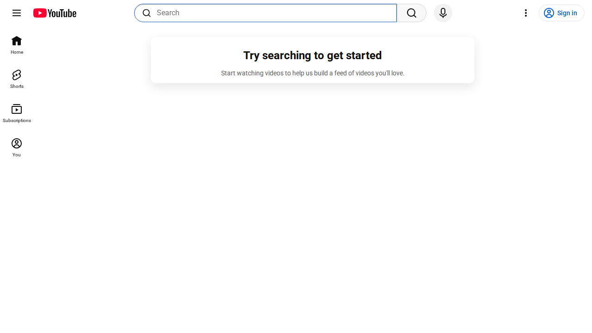

# Command: click-coordinates
**Result:** Clicked at (487,28)

**URL:** https://www.youtube.com/

## Links (8)
- https://www.youtube.com/
- https://accounts.google.com/ServiceLogin?service=youtube&uilel=3&passive=true&continue=https%3A%2F%2Fwww.youtube.com%2Fsignin%3Faction_handle_signin%3Dtrue%26app%3Ddesktop%26hl%3Den%26next%3Dhttps%253A%252F%252Fwww.youtube.com%252F&hl=en&ec=65620
- https://www.youtube.com/
- https://www.youtube.com/
- https://www.youtube.com/shorts/
- https://www.youtube.com/feed/subscriptions
- https://www.youtube.com/feed/you
- https://www.youtube.com/



## Clipboard
```

```